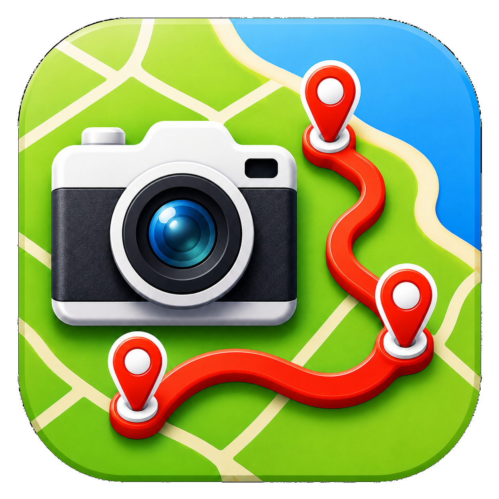
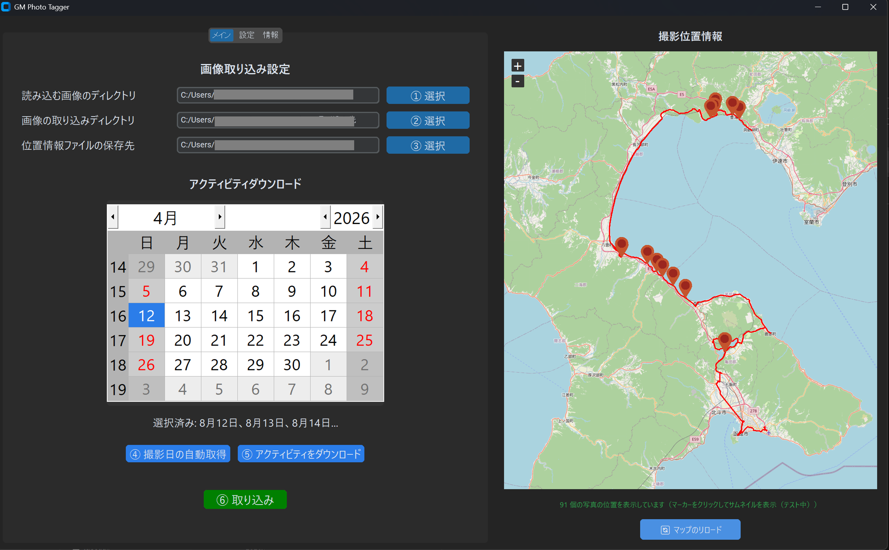

# GeotagPhoto

<p align="center">
  
</p>

Garmin Connectから取得したGPX/TCXを使って、画像にジオタグを付与するWindows向けGUIアプリです。  
Automatically geotag your photos using Garmin Connect GPS logs.



---

## 前提条件: ExifToolのインストール（必須）

事前に **ExifTool** のインストールが必要です。

1. 公式サイトからWindows 64bit版など利用環境に合わせたZIPファイルをダウンロード
   - https://exiftool.org/
2. ZIPファイルを展開し、**中身のすべてのファイルとフォルダ**（`exiftool(-k).exe` と `exiftool_files/` ディレクトリ）を配置先にコピー（例: `C:\Program Files\exiftool`）
3. 配置先にある `exiftool(-k).exe` を **`exiftool.exe`** にリネーム
4. Windowsの環境変数にパスを通す
   - Windowsメニューから「**環境変数の編集**」を検索して開く
   - ユーザー環境変数の **Path** を編集し、「新規」で配置先のパス（例: `C:\Program Files\exiftool`）を追加

---

## 起動方法

### 1. EXEファイルから実行（推奨）

#### ダウンロード

最新版は GitHub Releases からダウンロードできます。
- **[GeotagPhoto v1.2.2（最新）](https://github.com/HiKat/GeotagPhoto/releases/tag/v1.2.2)**

ZIP ファイル（`GeotagPhoto-v1.2.2-win64.zip`）をダウンロードしてください。

#### 前提条件

- **ExifTool** がインストール済みであること（上記参照）

#### 配布パッケージに含まれるもの

- `GeotagPhoto/` フォルダ一式（EXE本体 + 依存DLL + データファイル）
- `README.txt` - 簡易マニュアル

#### インストール手順

1. ZIPファイルを展開し、中の `GeotagPhoto` フォルダを **`C:\Program Files\GeotagPhoto`** などに配置
   - Windows Defender の誤検知を防ぐため、`Program Files` 配下への配置を推奨します
   - フォルダ内のDLLファイルはすべて必要です。**削除や移動をしないでください**
2. `GeotagPhoto` フォルダ内の `GeotagPhoto.exe` を右クリック →「ショートカットの作成」
3. 作成されたショートカットをデスクトップやタスクバーなど好きな場所に配置
4. ショートカットから起動してください

> **重要**: `GeotagPhoto.exe` は同じフォルダ内のDLLを参照するため、EXE単体を別の場所にコピーしても動作しません。必ずショートカットを利用してください。

#### 初回起動時

- `config.json` が自動生成されます
- Windows SmartScreen で「不明な発行元」の警告が出る場合は「詳細情報」→「実行」をクリックしてください

---

### 2. ソースから実行

#### 前提条件

- **Python 3.10以上** がインストールされていること
- **ExifTool** がインストール済みであること（上記参照）

#### インストール手順

```powershell
# 1. リポジトリのクローン
git clone <repository-url>
cd GeotagPhoto

# 2. 依存パッケージのインストール
pip install -r requirements.txt

# 3. アプリケーションの起動
python main.py
```

---

## 利用方法

### 初期設定

アプリを起動したら、まず **設定タブ** を開き、**Garmin Connect設定** の「ログイン」ボタンをクリックして Garmin Connect にログインしてください。ログイン情報はトークンとして安全にローカル保存されます。

### Garmin Connectを利用したジオタグ付与

ウィンドウ上の表示に従って、以下の手順で操作します。

1. **①読み込み画像のディレクトリを設定** — ジオタグを付与したい写真が入っているフォルダを選択
2. **②画像の取り込みディレクトリを設定** — ジオタグ付与後の画像のコピー先フォルダを選択
3. **③位置情報ファイルの保存先を設定** — GPX/TCXファイルの保存先フォルダを選択
4. **④撮影日の自動取得を押下** — 画像の撮影日を網羅的に取得します。取得された撮影日はカレンダー上で自動的に選択されますが、手動で日付を追加・変更することも可能です
5. **⑤アクティビティのダウンロードを押下** — カレンダーで選択された日付に対応するGPXファイルがGarmin Connectから自動でダウンロードされます
6. **⑥取り込みボタンを押下** — 画像が②で設定した取り込みディレクトリにジオタグ情報を付与されてコピーされます

処理結果は右画面のマップ上にマーカーとGPX軌跡で表示されます。

### Garmin Connect以外のサービスを利用する場合（Stravaなど）

Garmin Connect経由だけでなく、**Strava** などのサービスからGPXまたはTCXファイルを手動でダウンロードすることでも、写真にジオタグを付与できます。

1. 利用しているサービスからGPXまたはTCXファイルをダウンロード
2. **②画像の取り込みディレクトリ** を設定
3. **③位置情報ファイルの保存先** を設定し、ダウンロードしたGPX/TCXファイルをそのフォルダに配置
4. **⑥取り込みボタンを押下** して取り込みを実行

---

## ⚠️ 重要な注意事項

### Windows Defender の「コントロールされたフォルダー アクセス」について

Windows Defender のランサムウェア対策機能により、`Pictures`、`Documents`、`Desktop` などの保護対象フォルダ配下への書き込みがブロックされる場合があります。

この場合、取り込み時に `WinError 2: 指定されたファイルが見つかりません` や「取り込み先フォルダに書き込めません」と表示されることがあります。コピー元のSDカードや外付けドライブがマウントされていても、取り込み先への書き込みがブロックされている可能性があります。

GPX/TCXをGarmin ConnectやStravaからダウンロードする場合も同様です。`Documents\gpx` などをGPX/TCX保存先にしていると、「GPX保存先フォルダに書き込めません」と表示される場合があります。

対処方法:

- 取り込み先やGPX/TCX保存先を保護対象外のフォルダに変更する（例: `C:\GeotagPhoto\import`、`C:\GeotagPhoto\gpx`、外付けドライブ上の作業フォルダなど）
- Windows セキュリティで許可アプリに追加する
  - 配布版: `GeotagPhoto.exe` と `exiftool.exe`
  - ソース実行時: 使用している `python.exe` と `exiftool.exe`

許可設定は、Windows セキュリティ → ウイルスと脅威の防止 → ランサムウェアの防止を管理 → コントロールされたフォルダー アクセスでアプリを許可する、から変更できます。

アプリが取り込み先やGPX/TCX保存先に書き込めないことを検出した場合は、解決用のポップアップを自動表示します。ポップアップでは次の操作を行えます。

- **Defender の許可に追加**: UAC確認後、現在実行中の `GeotagPhoto.exe`、もしくは `python.exe` を許可アプリへ追加します。画像取り込み時は `exiftool.exe` も見つかれば同時に追加します。
- **別の保存先を選択**: 選択したフォルダを設定へ保存し、メイン画面の保存先にも反映します。
- **書き込みを再チェック**: 一時ファイルを作成・削除し、GeotagPhoto（もしくは `python.exe`）と、画像取り込み時は `exiftool.exe` がその保存先へ実際に書き込めるかを確認します。

許可設定は管理者権限が必要なため、Windowsのユーザー アカウント制御が表示されたら「はい」を選択してください。許可設定の完了後は、必ずポップアップの **「書き込みを再チェック」** を押してください。設定後も書き込めない場合はGeotagPhotoを再起動して再確認するか、別の保存先を選択してください。組織が管理するPCでは、ポリシーによりアプリから変更できない場合があります。

PowerShell から設定する場合は、PowerShellを**管理者として実行**し、次のコマンドを実行します。以下は、GeotagPhotoとExifToolを前述の推奨先である `Program Files` 配下に配置した場合の例です。`%ProgramFiles%` はWindowsによって実際の配置先に展開されるため、システムドライブやユーザー名には依存しません。

```powershell
Add-MpPreference -ControlledFolderAccessAllowedApplications `
  "%ProgramFiles%\GeotagPhoto\GeotagPhoto.exe", `
  "%ProgramFiles%\exiftool*\exiftool.exe"
```

`Add-MpPreference` は既存の許可アプリを残したまま追加します。`Set-MpPreference` は既存の許可一覧を置き換えるため、この用途では使用しないでください。設定後は、起動中のGeotagPhotoとExifToolを終了してからGeotagPhotoを再起動してください。

実際の配置先が異なる場合は、それぞれの実行ファイルのフルパスに置き換えてください。許可アプリのパスでは環境変数とワイルドカード `*` を使用できますが、ワイルドカードを使用できるのは**フォルダ部分だけ**です。

- 使用可能: `%ProgramFiles%\exiftool*\exiftool.exe`
- 使用不可: `%ProgramFiles%\exiftool\exiftool*.exe`

ワイルドカードは許可範囲を広げるため、バージョンごとにフォルダ名が変わる場合など、必要な範囲だけに限定してください。GeotagPhotoを `C:\Program Files\GeotagPhoto` のような固定パスへ配置すると、ワイルドカードを使用せず安全に許可できます。

詳細はMicrosoft公式ドキュメントの「[Configure controlled folder access](https://learn.microsoft.com/en-us/defender-endpoint/controlled-folder-access-configure)」を参照してください。

1. **config.jsonの扱い**
   - 初回起動時に自動生成されます（アプリ設定を保存します）
   - `.gitignore` で除外し、**絶対にGitにコミットしないでください**

2. **認証トークンの扱い**
   - Garmin Connect へのログイン後、認証トークンが `garmin_tokens/` フォルダにローカル保存されます
   - パスワードはアプリ内に保存されません
   - `.gitignore` で除外し、**絶対にGitにコミットしないでください**

---

### 🌐 API利用上の注意

1. **Garmin Connect API**
   - 非公式APIのため、予告なく仕様変更される可能性があります

2. **OpenStreetMap タイルサーバー**
   - 非営利目的の個人利用の範囲内で使用してください
   - 商用利用時は有償タイルサーバーの利用を検討してください
   - 利用規約: https://operations.osmfoundation.org/policies/tiles/

---

## ⚠️ ジオタグ付与後の重要な確認事項

### データの安全性について

**ジオタグ付与処理は成功したように見えても、アプリケーションが正常に完了したと表示されても、以下の確認を必ず実施してください：**

1. **必ず確認してから元のファイルを削除する**
   - ExifToolなどのソフトウェアを使用して、ジオタグが正しく付与されたか確認してください
   - 可能であれば複数の画像を確認してください

2. **編集・読み込みソフト上での動作確認**
   - Lightroom、Capture One、Adobe Bridge などで実際に画像を開いて確認してください
   - GPS情報が正しく表示されるか確認してください
   - メタデータが完全に読み込まれているか確認してください

3. **アプリケーション上での表示 ≠ 実際の動作**
   - GeotagPhotoで「ジオタグ付与完了」と表示されても、実際にはメタデータが正しく書き込まれていない可能性があります
   - ファイルのコピーや読み込みエラーが生じている場合があります
   - 必ず別のソフトウェアで検証してください

4. **推奨される操作フロー**
   - ① 元の画像ファイルはそのままディスク上に残す
   - ② GeotagPhotoで取り込み処理を実行
   - ③ 出力フォルダ内の画像をLightroomなどで開いて確認
   - ④ GPS情報が正しく表示されることを確認
   - ⑤ その後、確保した後に元のファイルを削除

5. **バックアップの重要性**
   - 重要な画像の場合は、処理前に必ずバックアップを取ってください
   - クラウドストレージなどに別途保存することをお勧めします

---

## ⚠️ タイムゾーンに関する注意

### 写真のEXIF日時とタイムゾーン

一般的なカメラ（デジタル一眼・ミラーレス・コンパクトカメラなど）の **DateTimeOriginal（撮影日時）はタイムゾーン情報を持ちません**（offset-naive）。  
この日時はカメラ本体の時刻設定に基づいており、カメラが設定されている地域の現地時刻です。

一方、GPXファイルに記録されている時刻は **UTC（協定世界時）** を基準とした offset-aware な日時です。

ジオタグを正確に付与するには、写真の撮影時刻をUTCに変換してGPXと照合する必要があります。

### タイムゾーンの判定ロジック

GeotagPhotoは以下の優先順位でタイムゾーンを判定します。

1. **OffsetTimeOriginalタグ** がEXIFに含まれる場合 → EXIF内のオフセット（例: `+09:00`）を使用
2. **OffsetTimeOriginalタグがない場合** → 設定タブの「カメラのタイムゾーン」をフォールバックとして使用

このため、異なるカメラの写真が混在していても、それぞれ正しいタイムゾーンで処理されます。

> **OffsetTimeOriginal** はEXIF 2.31（2016年）で追加されたタグです。Pentax、Sony、Canon（Rシリーズ以降）、Nikon（Zシリーズ以降）などの比較的新しいカメラは対応していますが、Leicaなど一部のカメラは対応していません。

### 対処方法

1. アプリを起動し「設定」タブを開く
2. **「カメラのタイムゾーン設定」** でカメラに設定しているタイムゾーンを選択する
3. 「設定を保存」をクリックする

> **デフォルト値は `Asia/Tokyo`（日本標準時 UTC+9）** です。  
> 海外旅行時などカメラの時刻を現地時刻に変更していた場合は、その場所のタイムゾーンを選択してください。

### 注意

- OffsetTimeOriginal対応カメラの写真は、本設定に関係なくEXIF内のタイムゾーンが使用されます。旅行先でカメラのタイムゾーンを変更した場合も正しく処理されます
- OffsetTimeOriginal非対応カメラ（Leicaなど）の写真にのみ、本設定のタイムゾーンがフォールバックとして適用されます
- カメラをUTCに設定して使用している場合は `UTC` を選択してください


## Garmin Connect 利用上の注意

本ソフトウェアは Garmin 社の公式 SDK ではなく、サードパーティ製ライブラリを利用して
Garmin Connect にアクセスします。  
Garmin Connect 側の仕様変更、認証方式の変更、レート制限、アカウント制限等により、
予告なく動作しなくなる可能性があります。

利用者は、関連する利用条件等を各自で確認し、自己責任で使用してください。

また、本ソフトウェアは認証情報やトークン等の機微情報を扱います。
共用 PC や不特定多数がアクセスできる環境での利用は推奨しません。
認証情報の漏えいが疑われる場合は、速やかにパスワード変更等の対応を行ってください。

## OpenStreetMap タイル利用上の注意

本ソフトウェアは OpenStreetMap の標準タイルサーバーを利用する場合があります。  
利用にあたっては OpenStreetMap Foundation の Tile Usage Policy に従ってください。

特に以下に注意してください。

- attribution を適切に表示すること
- キャッシュポリシーに従うこと
- 大量取得・bulk download・offline 用の無差別取得を行わないこと
- 大量利用や商用利用では代替タイルサーバーを検討すること

利用規約: https://operations.osmfoundation.org/policies/tiles/

## 免責事項

本ソフトウェアは現状有姿（as is）で提供されます。  
作者は、本ソフトウェアの利用または利用不能により生じたデータ損失、ファイル破損、
メタデータ不整合、アカウント制限、逸失利益、その他一切の損害について、
法令上許される範囲で責任を負いません。

画像・動画ファイルに対してメタデータの書き込みを行うため、処理前に必ずバックアップを作成してください。  
処理後は Lightroom、Capture One、Adobe Bridge 等の別ソフトウェアでも正常に開けることを確認し、
確認完了までは元ファイルを削除しないでください。

## ライセンス関連情報

本プロジェクトは **GNU General Public License v3.0 or later (GPLv3-or-later)** の条件で配布されます。詳細はリポジトリルートの [`COPYING`](COPYING) を参照してください。

### 対応ソース（Corresponding Source）

GitHub Releases で配布する各 exe について、対応する完全なソースコードは、
同じバージョンの Git tag 上で提供します。

例:
- 配布バイナリ: `v1.0.0`
- 対応ソース: `https://github.com/HiKat/GeotagPhoto/tree/v1.0.0`

### exe 配布物

Windows 向け配布物には、必要に応じて以下が含まれます。

- `GeotagPhoto.exe`
- `exiftool.exe`
- `COPYING`
- `README.txt`
- `third_party_licenses/`

### 第三者ライセンス

本プロジェクトは第三者ライブラリおよび外部ツールに依存しています。  
詳細は以下を参照してください。

- [`THIRD_PARTY_NOTICES.md`](THIRD_PARTY_NOTICES.md)
- `third_party_licenses/`
